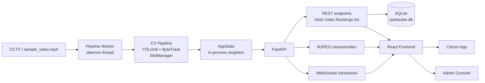

# ParkPulse Architecture

```mermaid
graph LR
    V[CCTV / sample_video.mp4] --> PW[Pipeline Worker<br/>daemon thread]
    PW --> CV[CV Pipeline<br/>YOLOv8 + ByteTrack<br/>SlotManager]
    CV --> AS[AppState<br/>in-process singleton]
    AS --> API[FastAPI]
    API --> WS[WebSocket /stream/ws]
    API --> MJPEG[MJPEG /stream/video]
    API --> REST[REST endpoints<br/>/slots /stats /bookings etc]
    REST --> DB[(SQLite<br/>parkpulse.db)]
    WS --> FE[React Frontend]
    MJPEG --> FE
    REST --> FE
    FE --> User[Citizen App]
    FE --> Admin[Admin Console]
```
